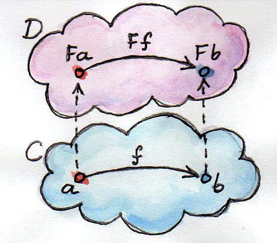

>Why we need to use functional programming.
Write your code with Less bugs in less time.
Your code will have less bugs because your code will be easier to reason about and you will be able to write it in less time because you will be able to reuse more of your code.


> - `Purity` & `Immutability`
>   - When Functional Programmers talk of Purity, they are referring to Pure Functions.
>   - Pure Functions will always produce the same output given the same inputs.
>   - All useful Pure Functions must return something.
>   - Pure functions have no side effects.


# Higher-order Function

- Function are values.  
Create an anonymous function and assign it to a variable. Just like any other value.
```javascript
function triple(x){
  return x * 3
}
```
```javascript
const triple = function(x){
  return x * 3
}
```
A function is a value , so it can be passed to another function (higher-order function).
what are higher-order function good for

- Composition
Composition the fact that we can take on function and put it into another function, allows us to compose a lot of small function into bigger functions.

``` javascript
const animals = [
  { name: 'Fluffykins',  species: 'rabbit'},
  { name: 'Caro',  species: 'dog'},
  { name: 'Hamilton',  species: 'dog'},
  { name: 'Harold',  species: 'fish'},
  { name: 'Ursual',  species: 'cat'},
  { name: 'Jimmy',  species: 'fish'},
]

const dogs = []
for (let i = 0; i < animals.length; i++){
  if(animals[i].species === 'dog'){
    dogs.push(animals[i]) 
  }
}

const dogs2 = animals.filter(animal=> animal.species === 'dog') 

// notice here the eample that uses filter is alot less code than the for loop
// less code means less bug and means less time.

const isDog = animal => animal.species === 'dog'
const dogs3 = animals.filter(isDog) 

const isCat = animal => animal.species === 'cat'
const cats = animals.filter(isCat) 

```
```javascript

// we want to get an array of all the names of the animals
const animals = [
  { name: 'Fluffykins',  species: 'rabbit'},
  { name: 'Caro',  species: 'dog'},
  { name: 'Hamilton',  species: 'dog'},
  { name: 'Harold',  species: 'fish'},
  { name: 'Ursual',  species: 'cat'},
  { name: 'Jimmy',  species: 'fish'},
]

const names = []
for (let i = 0; i< animals.length; i++){
  names.push(animals[i].name)
}

const names2 = animals.map(animal => animal.name)

```


``` javascript
//- Reuce
// There are lots of arary transofrmations on the arrary object.  But what to do if you can  't find one that fits. That is where reduce comes in.
// summarize all the amounts
const orders = [
  {amount: 250},
  {amount: 400},
  {amount: 100},
  {amount: 325}
]

let totalAmount = 0
for (var i = 0; i< orders.length; i++){
  totalAmount += orders[i].amount
}

console.log(totalAmount)

const totalAmount2 = orders.reduce((sum, order)=>sum + order.amount,0)
console.log(totalAmount2)

```
```
// parser the unstructured data
const doc = `
mark johansson  waffle iron  80  2
mark johansson  blender  200  1
mark johansson  knife  10  4
Nikita Smith  waffle iron  80  1
Nikita Smith  knife  10  2
Nikita Smith  pot  20  3
`

// const output = {
//   'mark johansson': [
//     {name: 'waffle iron', price: '80', quantity: '2'},
//     {name: 'blender', price: '200', quantity: '1'},
//     {name: 'knife', price: '10', quantity: '4'},
//   ],
//   'Nikita Smith': [
//     {name: 'waffle iron', price: '80', quantity: '1'},
//     {name: 'blender', price: '200', quantity: '2'},
//     {name: 'pot', price: '20', quantity: '3'},
//   ] 
// }

const output = doc
.trim()
.split('\n')
.map(item=>item.split('  '))
.reduce((pre, cur)=>{
  const customerName = cur[0];
  const orderItem = {name:cur[1], price: cur[2], quantity: cur[3]}
  return {
    ...pre,
    [customerName]:pre[customerName] ? [...pre[customerName], orderItem] : [orderItem]
  }
}, {})

console.log(output)
// Good functional code is make up of small functions that do one thing and you just find them all together.
```

# Recursion
Recursion is when a function calls itself until it doesn't.
```javascript
// countDownFrom(10) 
// show count down 10 9 ... 1

const countDownFrom = (num) => {
  console.log(num--)
  num >=0 && countDownFrom(num)
}

countDownFrom(10)


const categories = [
  { id: 'animals', parent: null },
  { id: 'mammals', parent: 'animals' },
  { id: 'cats', parent: 'mammals' },
  { id: 'dogs', parent: 'mammals' },
  { id: 'chihuahua', parent: 'dogs' },
  { id: 'labrador', parent: 'dogs' },
  { id: 'persian', parent: 'cats' },
  { id: 'siamese', parent: 'cats' },
]

// const output = {
//   animals:{
//     mammals:{
//       dogs:{
//         chihuahua:null,
//         labrador: null
//       },
//       cats:{
//         persian: null,
//         siamese: null
//       }
//     }
//   }
// } 


const makeTree = (categories, parent) => {
  const node = {}
  categories
    .filter(c => c.parent === parent)
    .forEach(c => node[c.id] = makeTree(categories, c.id))
  return node
}

console.log(JSON.stringify(
  makeTree(categories, null)
  , null, 2))

```

# Functor
Functor is the object that has map method.
For example,in javaScript array is the functor.


# Monad
Monad is a more powerful functor, that also implements flatmap.
The flatMap() method returns a new array formed by applying a given callback function to each element of the array, and then flattening the result by `one level`.  It is identical to a map() followed by a flat() of depth 1, but slightly more efficient than calling those two methods separately.
```javascript
const arr = [1, 2, 3, 4];
arr.flatMap(x => [x, x * 2]);
// [1, 2, 2, 4, 3, 6, 4, 8]

let arr1 = ["it's Sunny in", "", "California"];
arr1.map(x => x.split(" "));
// [["it's","Sunny","in"],[""],["California"]]

arr1.flatMap(x => x.split(" "));
// ["it's","Sunny","in", "", "California"]

```